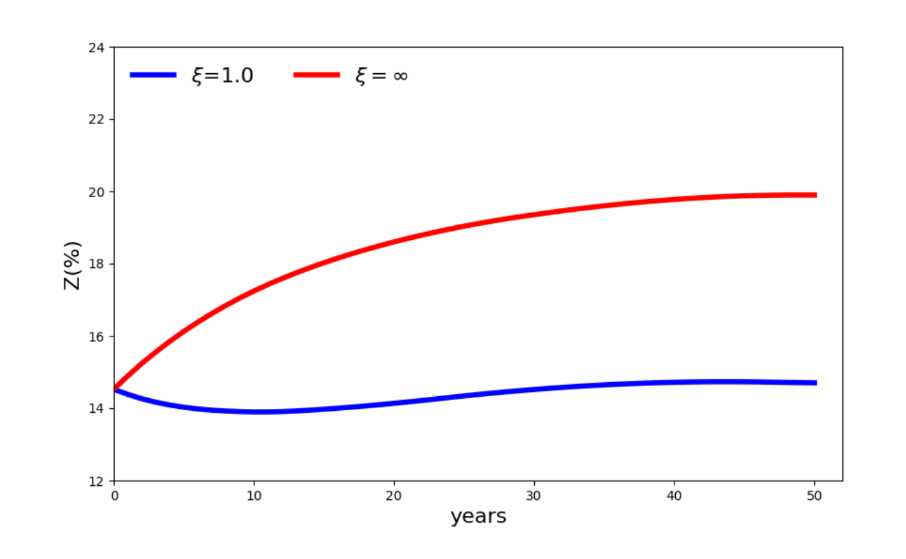
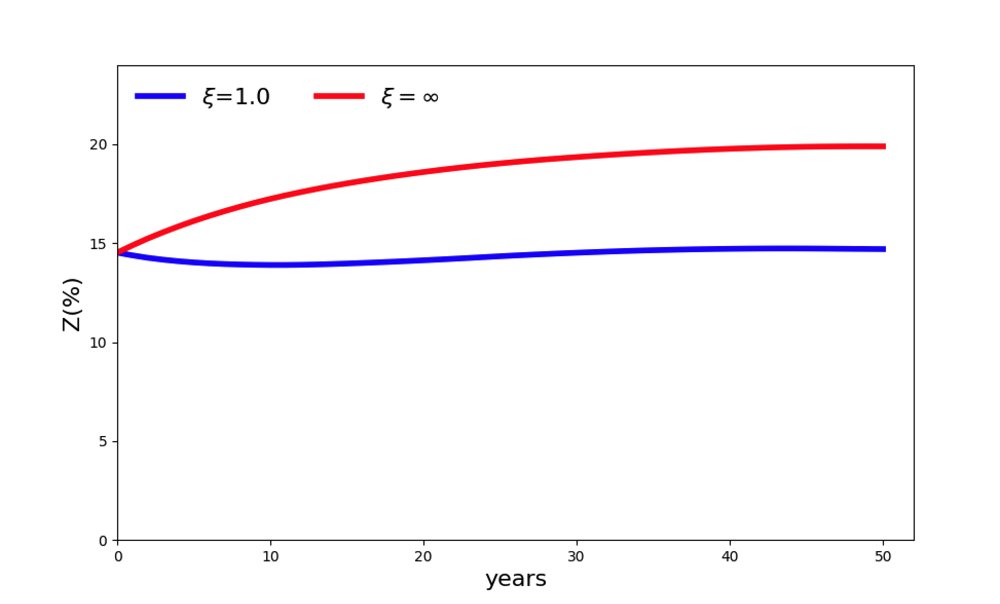

# Paper Identification

|           |                      |
|-----------|----------------------|
| ID        |  |
| Author    |    |
| Title     |     |
| Iteration |     |

Some useful information up front:

-   [JPE Data and Code Availability Policy](https://www.journals.uchicago.edu/journals/jpe/datapolicy)
-   [Step by step guidance from Data Editor for Authors](https://jpedataeditor.github.io/)
-   [Template README](https://social-science-data-editors.github.io/template_README/)

# Summary

In assessing compliance with our [Data and Code Availability Policy](https://www.journals.uchicago.edu/journals/jpe/datapolicy), our reproducibility team has identified the following issues, which we ask you to address:

1.  Data Editor's first point.
2.  Data Editor's second point.

# General

-   [x] Data Availability and Provenance Statements
    -   [x] Statement about Rights - Part 1: Right to use the data (e.g. *did the authors lawfully obtain the data*)
    -   [x] Statement about Rights - Part 2: Right to publish the data (e.g. *are human subjects involved and did permission been granted to publish their data?*)
    -   [x] License for Data (optional, but recommended)
    -   [x] Details on each Data Source
-   [x] Dataset list
-   [x] Computational requirements
    -   [x] Software Requirements
    -   [ ] Controlled Randomness (as necessary)
    -   [ ] Memory, Runtime, and Storage Requirements
-   [x] Description of programs/code
    -   [x] License for Code (Optional, but recommended)
-   [x] List of programs
-   [ ] List of tables
-   [x] References (Optional, but recommended)

# High-level Description of Research Project

*This research project...*

-   [x] uses observational data.
-   [ ] uses *confidential* observational data.
-   [ ] uses data generated via experiment or trial by the authors (in field or lab).
    -   [ ] For lab experiments: The code to implement the experimental protocol (z-Tree, o-Tree etc) is included in the package.
    -   [ ] A PDF copy of IRB approval is contained in the package.
    -   [ ] A PDF document outlining the design of the experiment, including information on the selection and eligibility of participants is included.
    -   [ ] A PDF copy of the instructions given to participants in both original language and an English translation is included.
-   [ ] uses data generated via survey by the authors (in field or online)
    -   [ ] The programs used to administer the survey (e.g. qualtrics survey file) are included.
    -   [ ] A PDF copy of IRB approval is contained in the package.
    -   [ ] A PDF of the original questionaire(s) and information on the selection and eligibility of participants is included.
-   [ ] is a simulation study: the data are generated by an algorithm.
-   [ ] is a numerical illustration: no data are used but code is used to produce illustrative output (tables, figures)

## Data Sources

| file/name | public | private | DOI/URL | Access described | cited readme | cited paper |
|-----------|-----------|-----------|-----------|-----------|-----------|-----------|
| World Bank / WDI and Climate Watch | yes | no | yes | yes | yes | no |
| Amazonia 2030 / Fatos da Amazonia 2021 | yes | no | yes | yes | yes | no |
| MapBiomas Collection 5 | yes | no | yes | yes | yes | no |
| ANA/PNRH basin layers via MapBiomas | yes | no | yes | yes | yes | no |
| ESA Biomass Climate Change Initiative | yes | no | yes | yes | yes | no |
| SEEG emissions data | yes | no | yes | yes | yes | no |
| IBGE agricultural census / geographies | yes | no | yes | yes | yes | yes |
| SEAB-PR / DERAL via IPEA | yes | no | yes | yes | yes | yes |
| IPEA distance-to-capital data | yes | no | yes | yes | yes | no |
| WorldClim 2.1 climate rasters | yes | no | yes | yes | yes | yes |
| FGV IBRE deflator series | yes | no | yes | yes | yes | no |
| World Bank Carbon Pricing Dashboard | yes | no | yes | yes | yes | no |

- "Data Citations" were identified from the README. However, they do not follow any specific citation format. It is recommended to make them all consistent with the JPE citation requirements with the same citation appearing in the paper and the README.

- Access conditions are described in `codebook.csv`

### World Bank / WDI and Climate Watch

-   [x] Dataset is provided in public deposit
-   [ ] Dataset is PRIVATELY provided (not for publication)
-   [x] DOI or URL is provided, and works
-   [x] Access conditions are described
-   [ ] Data are not cited, but a working paper, article, or other document is cited (not a data citation)
-   [x] Data are cited
    -   [ ] in the manuscript
    -   [x] in the README
    
> World Bank. World Development Indicators and World Bank source files used for Figure 1, GDP per capita, emissions, and carbon-pricing inputs. URLs: https://data.worldbank.org/, https://databank.worldbank.org/source/world-development-indicators, and https://carbonpricingdashboard.worldbank.org/. Access note: manuscript Figure 1 reports World Bank data were downloaded in March 2021.

> World Resources Institute. Climate Watch data used with World Bank inputs for Figure 1 emissions context. URL: https://www.climatewatchdata.org/. Access note: retain exact downloaded extracts and metadata under replication/figure1/ and data/raw/worldbank/.

### Amazonia 2030 / Fatos da Amazonia 2021

-   [x] Dataset is provided in public deposit
-   [ ] Dataset is PRIVATELY provided (not for publication)
-   [x] DOI or URL is provided, and works
-   [x] Access conditions are described
-   [ ] Data are not cited, but a working paper, article, or other document is cited (not a data citation)
-   [x] Data are cited
    -   [ ] in the manuscript
    -   [x] in the README

> Amazonia 2030. 2021. Fatos da Amazonia 2021. Amazonia 2030. URL: https://amazonia2030.org.br/. Used for the Brazilian Amazon point in Figure

### MapBiomas Collection 5

-   [x] Dataset is provided in public deposit
-   [ ] Dataset is PRIVATELY provided (not for publication)
-   [x] DOI or URL is provided, and works
-   [x] Access conditions are described
-   [ ] Data are not cited, but a working paper, article, or other document is cited (not a data citation)
-   [x] Data are cited
    -   [ ] in the manuscript
    -   [x] in the README
    
> MapBiomas Project. Collection 5 Annual Land Cover and Land Use Maps of Brazil and related MapBiomas products. URL: https://mapbiomas.org/. Used for land-use/cover, total available area, agricultural area, deforestation, secondary vegetation age, pasture quality, and basin inputs. See also Souza Jr. et al. (2020), cited in the manuscript.

### ANA/PNRH basin layers via MapBiomas

-   [x] Dataset is provided in public deposit
-   [ ] Dataset is PRIVATELY provided (not for publication)
-   [x] DOI or URL is provided, and works
-   [x] Access conditions are described
-   [ ] Data are not cited, but a working paper, article, or other document is cited (not a data citation)
-   [x] Data are cited
    -   [ ] in the manuscript
    -   [x] in the README

> Agencia Nacional de Aguas e Saneamento Basico (ANA). 2006. National Water Resources Plan basin layers, level 2. Distributed through MapBiomas basin inputs. URL: https://www.gov.br/ana/. Used for basin groups in Appendix C.1.

### ESA Biomass Climate Change Initiative

-   [x] Dataset is provided in public deposit
-   [ ] Dataset is PRIVATELY provided (not for publication)
-   [x] DOI or URL is provided, and works
-   [x] Access conditions are described
-   [ ] Data are not cited, but a working paper, article, or other document is cited (not a data citation)
-   [x] Data are cited
    -   [ ] in the manuscript
    -   [x] in the README

> European Space Agency Climate Change Initiative Biomass Project. 2021. ESA Biomass Climate Change Initiative (Biomass_cci): Global Datasets of Forest Above-Ground Biomass for the Years 2010, 2017 and 2018, v3. NERC EDS Centre for Environmental Data Analysis. DOI: 10.5285/5f331c418e9f4935b8eb1b836f8a91b8. URL: https://climate.esa.int/en/projects/biomass/. Used for 2017 above-ground biomass inputs.

### SEEG emissions data

-   [x] Dataset is provided in public deposit
-   [ ] Dataset is PRIVATELY provided (not for publication)
-   [x] DOI or URL is provided, and works
-   [x] Access conditions are described
-   [ ] Data are not cited, but a working paper, article, or other document is cited (not a data citation)
-   [x] Data are cited
    -   [ ] in the manuscript
    -   [x] in the README

> Sistema de Estimativas de Emissoes e Remocoes de Gases de Efeito Estufa (SEEG). Greenhouse-gas emissions and removals data. URL: https://seeg.eco.br/. Used for agricultural net emissions and emissions calibration; raw filenames record a 2020.11.05 extract.

### IBGE agricultural census / geographies

-   [x] Dataset is provided in public deposit
-   [ ] Dataset is PRIVATELY provided (not for publication)
-   [x] DOI or URL is provided, and works
-   [x] Access conditions are described
-   [ ] Data are not cited, but a working paper, article, or other document is cited (not a data citation)
-   [x] Data are cited
    -   [x] in the manuscript
    -   [x] in the README

### SEAB-PR / DERAL via IPEA

-   [x] Dataset is provided in public deposit
-   [ ] Dataset is PRIVATELY provided (not for publication)
-   [x] DOI or URL is provided, and works
-   [x] Access conditions are described
-   [ ] Data are not cited, but a working paper, article, or other document is cited (not a data citation)
-   [x] Data are cited
    -   [x] in the manuscript
    -   [x] in the README

> Instituto de Pesquisa Economica Aplicada (IPEA). Ipeadata tables for distance-to-capital and farm-gate or commodity-price inputs. URL: https://www.ipeadata.gov.br/. Access notes: the manuscript reports SEAB-PR price data distributed through IPEA were accessed on February 22, 2021; the distance raw filename records an August 21, 2023 extract.

### IPEA distance-to-capital data

-   [x] Dataset is provided in public deposit
-   [ ] Dataset is PRIVATELY provided (not for publication)
-   [x] DOI or URL is provided, and works
-   [x] Access conditions are described
-   [ ] Data are not cited, but a working paper, article, or other document is cited (not a data citation)
-   [x] Data are cited
    -   [ ] in the manuscript
    -   [x] in the README

> Instituto de Pesquisa Economica Aplicada (IPEA). Ipeadata tables for distance-to-capital and farm-gate or commodity-price inputs. URL: https://www.ipeadata.gov.br/. Access notes: the manuscript reports SEAB-PR price data distributed through IPEA were accessed on February 22, 2021; the distance raw filename records an August 21, 2023 extract.

### WorldClim 2.1 climate rasters

-   [x] Dataset is provided in public deposit
-   [ ] Dataset is PRIVATELY provided (not for publication)
-   [x] DOI or URL is provided, and works
-   [x] Access conditions are described
-   [ ] Data are not cited, but a working paper, article, or other document is cited (not a data citation)
-   [x] Data are cited
    -   [x] in the manuscript
    -   [x] in the README

> Fick, Stephen E., and Robert J. Hijmans. 2017. "WorldClim 2: New 1-km Spatial Resolution Climate Surfaces for Global Land Areas." International Journal of Climatology 37 (12): 4302-4315. DOI: 10.1002/joc.5086. Project URL: https://www.worldclim.org/. The package uses WorldClim 2.1, 2.5-minute historical temperature and precipitation rasters.

### FGV IBRE deflator series

-   [x] Dataset is provided in public deposit
-   [ ] Dataset is PRIVATELY provided (not for publication)
-   [x] DOI or URL is provided, and works
-   [x] Access conditions are described
-   [ ] Data are not cited, but a working paper, article, or other document is cited (not a data citation)
-   [x] Data are cited
    -   [ ] in the manuscript
    -   [x] in the README
    
> Fundacao Getulio Vargas, Instituto Brasileiro de Economia (FGV IBRE). Deflator series used for price preparation. URL: https://portalibre.fgv.br/. Access note: retain exact raw files and access metadata in the final archive.

### World Bank Carbon Pricing Dashboard

-   [x] Dataset is provided in public deposit
-   [ ] Dataset is PRIVATELY provided (not for publication)
-   [x] DOI or URL is provided, and works
-   [x] Access conditions are described
-   [ ] Data are not cited, but a working paper, article, or other document is cited (not a data citation)
-   [x] Data are cited
    -   [ ] in the manuscript
    -   [x] in the README

> World Bank. World Development Indicators and World Bank source files used for Figure 1, GDP per capita, emissions, and carbon-pricing inputs. URLs: https://data.worldbank.org/, https://databank.worldbank.org/source/world-development-indicators, and https://carbonpricingdashboard.worldbank.org/. Access note: manuscript Figure 1 reports World Bank data were downloaded in March 2021.

# Requirements

-   [x] README is in TXT, MD, or PDF format
-   [x] README is accessible at the root of the package (not inside a folder)
-   [ ] Title conforms to guidance (starts with "Data and Code for: Title of Paper" or "Code for: Title of Paper", is properly capitalized)
-   [ ] Authors (with affiliations) are listed in the same order as on the paper

> {REQUIRED} Please review the title of the deposit as per our guidelines.

> {REQUIRED} Please review authors and affiliations on the deposit. In general, they are the same, and in the same order, as for the manuscript; however, authors can deviate from that order.

## Stated Requirements

-   [ ] No requirements specified
-   [x] Software Requirements specified as follows:
    -   Python \>= 3.9 and \<3.12
    -   R with `renv`
    -   Gurobi \>= 10.0.3
    -   CmdStan through `cmdstanpy`
    -   Slurm (optional)
-   [ ] Computational Requirements specified as follows:
    -   Cluster size, etc.
-   [x] Time Requirements specified as follows:
    -   46 hours (with Slurm parallelization)
    -   2,400 job-hours (across parallel tasks)
-   [ ] Requirements are complete.

For missing requirements, see the list of required changes in @sec-findings

# Analyzing Data and Code Files











## Code description



-   [x] The replication package contains a "main" or "master" file(s) which calls all other auxiliary programs.
-   The replication folder contains 48 R scripts, 49 Python files, and 2 shell scripts
-   The README does not identify which tables and plots are produced by what program. However, there is a separate manifest that shows the source file for the replication of each table and figure.
-   The README also does not identify the 5 in-text numbers that do not refer to tables. 

> NOTE: In-text numbers that reference numbers in tables do not need to be listed. Only in-text numbers that correspond to no table or figure need to be listed.

## Computing Environment of the Replicator

-   Nuvolos Cloud Server, "Ubuntu 24.04.1 LTS", AMD EPYC 9354P, 32 cores, 64GB RAM
-   R `sessionInfo()` below:

``` bash
R version 4.5.3 (2026-03-11)
Platform: x86_64-conda-linux-gnu
Running under: Ubuntu 24.04.1 LTS

Matrix products: default
BLAS/LAPACK: /opt/conda/lib/libopenblasp-r0.3.30.so;  LAPACK version 3.12.0

locale:
 [1] LC_CTYPE=en_US.UTF-8       LC_NUMERIC=C              
 [3] LC_TIME=en_US.UTF-8        LC_COLLATE=en_US.UTF-8    
 [5] LC_MONETARY=en_US.UTF-8    LC_MESSAGES=en_US.UTF-8   
 [7] LC_PAPER=en_US.UTF-8       LC_NAME=C                 
 [9] LC_ADDRESS=C               LC_TELEPHONE=C            
[11] LC_MEASUREMENT=en_US.UTF-8 LC_IDENTIFICATION=C       

time zone: Etc/UTC
tzcode source: system (glibc)

attached base packages:
[1] stats     graphics  grDevices utils     datasets  methods   base     

loaded via a namespace (and not attached):
[1] compiler_4.5.3
```

-   R 4.5.3
-   Python 3.11

# Replication

Created a Gurobi academic account, downloaded the license, and uploaded it to the working environment.

Set the Gurobi license path in the shell:

``` bash
export GRB_LICENSE_FILE=/files/gurobi.lic
```

## Initial Environment Setup

Attempted to source the setup script in local mode:

``` bash
source ./setup_env.sh local
```

This produced a virtual environment permission error:

```         
Unable to symlink '/opt/conda/bin/python3' to '/files/package/amazon-carbon-prices/.venv/bin/python3'
bash: /files/package/amazon-carbon-prices/.venv/bin/python: Permission denied
[... additional setup output omitted ...]
```

Tried fixing the virtual environment by removing `.venv`, making the setup script executable, and rerunning setup:

``` bash
rm -rf .venv
chmod +x ./setup_env.sh
./setup_env.sh local
```

## Missing R

The setup script then reported that `Rscript` was unavailable:

```         
Warning: Rscript is not available. Install R first, then rerun without --skip-renv.
```

Fixed by installing R through conda:

``` bash
conda install -c conda-forge r-base r-essentials
```

Later, rebuilt the environment more completely with Python, R, ImageMagick, and `pkg-config`:

``` bash
conda create -n amazon-carbon -c conda-forge python=3.11 "r-base=4.4.*" r-essentials imagemagick pkg-config -y
conda activate amazon-carbon
```

## R Package: `magick`

The `magick` package failed because the Magick++ headers/libraries were missing:

```         
Error: Error installing package 'magick':
Configuration failed to find the Magick++ library.
<stdin>:1:10: fatal error: Magick++.h: No such file or directory
[... additional renv traceback omitted ...]
```

Fixed by creating a fuller conda environment with ImageMagick and `pkg-config`:

``` bash
conda create -n amazon-carbon -c conda-forge python=3.11 "r-base=4.4.*" r-essentials imagemagick pkg-config -y
conda activate amazon-carbon
```

## R Package: `nloptr`

The `nloptr` package failed during the local NLopt/CMake build:

```         
Error: Error installing package 'nloptr':
CMake Error at CMakeLists.txt:15 (cmake_minimum_required): Compatibility with CMake < 3.5 has been removed from CMake.
/opt/conda/envs/amazon-carbon/.../ld: cannot find nlopt/lib/libnlopt.a: No such file or directory
[... additional compiler and renv output omitted ...]
```

Fixed by installing NLopt and build tools from conda-forge:

``` bash
conda install -c conda-forge nlopt cmake pkg-config -y
```

## R Package: `units`

The `units` package failed because `libudunits2` was missing:

```         
Error: Error installing package 'units':
configure: error: Configuration failed because libudunits2.so was not found.
[... additional configure and renv output omitted ...]
```

Fixed by installing `udunits2` and `expat`:

``` bash
conda install -c conda-forge udunits2 expat -y
```

## R Package: `sf`

The first `sf` installation failed because `gdal-config` was missing:

```         
Error: Error installing package 'sf':
configure: error: gdal-config not found or not executable.
[... additional renv traceback omitted ...]
```

Installed the spatial libraries:

``` bash
conda install -c conda-forge gdal geos proj sqlite libspatialite -y
```

The next `sf` installation reached GDAL, GEOS, and PROJ, but failed compiling against the newer GDAL API:

```         
Error: Error installing package 'sf':
stars.cpp:24:48: error: invalid conversion from 'CSLConstList' {aka 'const char* const*'} to 'char**' [-fpermissive]
[... additional compiler output and renv traceback omitted ...]
```

Fixed by pinning GDAL/libGDAL to the 3.8 series:

``` bash
conda install -c conda-forge "gdal=3.8.*" "libgdal=3.8.*" geos proj sqlite libspatialite -y
```

The next `sf` attempt failed because PROJ data could not be found:

```         
Error: Error installing package 'sf':
ERROR 1: PROJ: proj_create_from_database: Open of /opt/conda/envs/amazon-carbon/share/proj failed
configure: error: OGRCoordinateTransformation() does not return a coord.trans: PROJ not available?
[... additional configure and renv output omitted ...]
```

Fixed by installing `proj-data` and exporting the relevant data paths:

``` bash
conda install -c conda-forge proj proj-data -y
export PROJ_LIB=/opt/conda/envs/amazon-carbon/share/proj
export PROJ_DATA=/opt/conda/envs/amazon-carbon/share/proj
export GDAL_DATA=/opt/conda/envs/amazon-carbon/share/gdal
```

## R Package: `systemfonts`

The `systemfonts` package failed because `uint32_t` was not declared:

```         
Error: Error installing package 'systemfonts':
ft_cache.h:159:18: error: 'uint32_t' has not been declared
ft_cache.h:20:1: note: 'uint32_t' is defined in header '<cstdint>'; this is probably fixable by adding '#include <cstdint>'
[... additional compiler output and renv traceback omitted ...]
```

Fixed by creating an R `Makevars` file that forces inclusion of `cstdint`:

``` bash
mkdir -p ~/.R
cat > ~/.R/Makevars <<'EOF'
CXXFLAGS += -include cstdint
CXX11FLAGS += -include cstdint
CXX14FLAGS += -include cstdint
CXX17FLAGS += -include cstdint
CXX20FLAGS += -include cstdint
EOF
```

## R Package: `ragg`

The `ragg` package failed on an invalid conversion in the bundled AGG/Freetype code:

```         
Error: Error installing package 'ragg':
agg/src/agg_font_freetype.cpp:182:35: error: invalid conversion from 'unsigned char*' to 'char*' [-fpermissive]
[... additional compiler output and renv traceback omitted ...]
```

Fixed by adding `-fpermissive` to the R `Makevars` C++ flags:

``` bash
cat > ~/.R/Makevars <<'EOF'
CXXFLAGS += -include cstdint -fpermissive
CXX11FLAGS += -include cstdint -fpermissive
CXX14FLAGS += -include cstdint -fpermissive
CXX17FLAGS += -include cstdint -fpermissive
CXX20FLAGS += -include cstdint -fpermissive
EOF
```

## R Package: `selectr`

The `selectr` package failed because cached `stringi` was linked against a missing ICU library:

```         
Error: Error installing package 'selectr':
unable to load shared object '.../stringi/libs/stringi.so': libicuuc.so.78: cannot open shared object file: No such file or directory
[... additional lazy-loading and renv output omitted ...]
```

Fixed by removing the stale cached `stringi` package:

``` bash
rm -rf /tmp/R/renv/cache/v5/linux-ubuntu-noble/R-4.4/x86_64-conda-linux-gnu/stringi
```

## R Package: `terra`

The `terra` package initially failed because the C compiler could not create executables:

```         
Error: Error installing package 'terra':
configure: error: C compiler cannot create executables
[... additional configure and renv output omitted ...]
```

Tried installing compiler/runtime packages:

``` bash
conda install -c conda-forge compilers libstdcxx-ng libgcc-ng sysroot_linux-64 make -y
```

When the source installation failed again, installed `terra` directly from conda-forge:

``` bash
conda install -c conda-forge r-terra -y
```

After that, `terra` installed successfully:

```         
Installing terra ... OK [built from source and cached in 3.4m]
```

## R Package: `tidyverse`

The `tidyverse` package failed because `stringi` was linked against a missing ICU library:

```         
Error: Error installing package 'tidyverse':
unable to load shared object '.../stringi/libs/stringi.so': libicui18n.so.75: cannot open shared object file: No such file or directory
[... additional package-loading and renv output omitted ...]
```

Fixed by removing the stale cached `stringi` package again:

``` bash
rm -rf /tmp/R/renv/cache/v5/linux-ubuntu-noble/R-4.4/x86_64-conda-linux-gnu/stringi
```

## `sf` Runtime Linkage Issue

After installing `r-terra`, `sf` failed to load because it was linked against a missing GDAL shared library:

```         
Error: package or namespace load failed for 'sf':
unable to load shared object '.../sf/libs/sf.so': libgdal.so.34: cannot open shared object file: No such file or directory
```

Fixed by removing `r-terra` and reinstalling a consistent GDAL stack:

``` bash
conda remove r-terra -y
conda install -c conda-forge "gdal=3.8.5" "libgdal=3.8.5" geos proj proj-data sqlite libspatialite -y
```

## CmdStan Build

Building CmdStan failed because `TBB_CXX_TYPE` was not set for the conda compiler:

```         
stan/lib/stan_math/make/libraries:114: *** "Need to set TBB_CXX_TYPE for non-standard compiler other than gcc or clang.". Stop.
```

Fixed by setting the conda environment paths and `TBB_CXX_TYPE`, then rebuilding:

``` bash
cd /home/datahub/.cmdstan/cmdstan-2.39.0

export CONDA_PREFIX=/opt/conda/envs/amazon-carbon
export PATH=$CONDA_PREFIX/bin:$PATH
export MAKE=$CONDA_PREFIX/bin/make
export TBB_CXX_TYPE=gcc

/opt/conda/envs/amazon-carbon/bin/make build -j1
```

-   After this `setup_env.sh` ran to completion.
-   The full pipeline was not run due computational limitations. A shorter run based on the README was run and finished to completion.

``` bash
./run.sh --steps postprocess-only --backend local
```

# Findings {#sec-findings}

## Missing Requirements

-   [x] Software Requirements
    -   [x] R
        -   [x] Version 4.4
        -   No packages mentioned in the README
    -   [x] Python
        -   No Python packages mentioned in the README
    -   [x] GDAL
-   [x] Computational Requirements specified as follows:
    -   Cluster size, disk size, memory size, etc.
    -   Nothing specified in the README

> \[REQUIRED\] Please amend README to contain complete requirements.

## Data Preparation Code

| Data Preparation Program       | Dataset created                                                                                                                                                                                                                                                                                                                    | Reproduced? |
|--------------------------------|------------------------------------------------------------------------------------------------------------------------------------------------------------------------------------------------------------------------------------------------------------------------------------------------------------------------------------|-------------|
| rsrc/cleaning/_masterfile.R    | data/clean/: cleaned source-specific Rdata and raster files                                                                                                                                                                                                                                                                        | NA          |
| rsrc/processing/_masterfile.R  | data/processed/: cattle_price_index.Rdata; pixel_sample.Rdata; pixel_areas.Rdata; pixel_categories.Rdata; pixel_primary_forest_2017.Rdata; pixel_biomass_2017.Rdata; spatial, cross-section, and panel municipality samples; muni_biomass_2017.Rdata; muni_data.Rdata; state_emissions.Rdata; processed land-use and biome rasters | NA          |
| rsrc/calibration/_masterfile.R | data/calibration/: calibration_1043_sites.Rdata/.csv; grid_1043_sites.geojson; calibration_78_sites.Rdata/.csv; grid_78_sites.geojson; gamma/theta calibration objects and fitted GeoJSON inputs                                                                                                                                   | NA          |


- Already described the issues in Section 7.
- The main R code to create the processed, clean and calibration files was not run due to computation limitations.

## Tables and Figures
| Figure/Table # | Program                                                  | Line Number | Reproduced? |
|----------------|----------------------------------------------------------|-------------|-------------|
| Figure 1       | pysrc/scripts/figure1.py                                 | 166         | Yes         |
| Figure 2       | rsrc/analysis/carbon_capture_curves/02_analysis.R        | 68          | Yes         |
| Figure 3a      | rsrc/analysis/calibration_maps_1043_sites.R              | 104         | Yes         |
| Figure 3b      | rsrc/analysis/calibration_maps_1043_sites.R              | 195         | Yes         |
| Figure 4a      | rsrc/analysis/calibration_maps_1043_sites.R              | 225         | Yes         |
| Figure 4b      | rsrc/analysis/calibration_maps_1043_sites.R              | 246         | Yes         |
| Figure 5a      | pysrc/analysis/figures.py                                | 116         | Yes         |
| Figure 5b      | pysrc/analysis/figures.py                                | 161         | Yes         |
| Figure 6       | pysrc/analysis/figures.py                                | 557         | Yes         |
| Figure 7       | rsrc/analysis/map_1043_det.R                             | 305         | Yes         |
| Figure 8       | rsrc/analysis/map_1043_det.R                             | 353         | Yes         |
| Figure 9a      | pysrc/analysis/figures.py                                | 374         | Yes         |
| Figure 9b      | pysrc/analysis/figures.py                                | 313         | Yes         |
| Figure 9c      | pysrc/analysis/figures.py                                | 404         | Yes         |
| Figure 9d      | pysrc/analysis/figures.py                                | 344         | Yes         |
| Figure 10      | pysrc/analysis/map.py                                    | 114         | Yes         |
| Figure 11      | pysrc/analysis/figures.py                                | 482         | Yes         |
| Figure 12a     | pysrc/analysis/map.py                                    | 114         | Yes         |
| Figure 12b     | pysrc/analysis/map.py                                    | 114         | Yes         |
| Figure 13a     | pysrc/analysis/figures.py                                | 483         | Yes         |
| Figure 13b     | pysrc/analysis/figures.py                                | 483         | Yes         |
| Figure 14a     | pysrc/scripts/mpc_trajectory.py                          | 117         | Yes         |
| Figure 14b     | pysrc/scripts/mpc_trajectory.py                          | 117         | Yes         |
| Figure 15a     | pysrc/scripts/price_estimation.py                        | 130         | Yes         |
| Figure 15b     | pysrc/scripts/price_estimation.py                        | 130         | Yes         |
| Figure 16a     | rsrc/analysis/map_kl.R                                   | 352         | Yes         |
| Figure 16b     | rsrc/analysis/map_kl.R                                   | 366         | Yes         |
| Figure 16c     | rsrc/analysis/map_kl.R                                   | 359         | Yes         |
| Figure 16d     | rsrc/analysis/map_kl.R                                   | 373         | Yes         |
| Figure 17a     | pysrc/analysis/figures.py                                | 374         | Yes         |
| Figure 17b     | pysrc/analysis/figures.py                                | 313         | Yes         |
| Figure 17c     | pysrc/analysis/figures.py                                | 404         | Yes         |
| Figure 17d     | pysrc/analysis/figures.py                                | 344         | Yes         |
| Figure 18a     | pysrc/analysis/figures.py                                | 374         | Yes         |
| Figure 18b     | pysrc/analysis/figures.py                                | 313         | Yes         |
| Figure 18c     | pysrc/analysis/figures.py                                | 404         | Yes         |
| Figure 18d     | pysrc/analysis/figures.py                                | 344         | Yes         |
| Figure 19      | rsrc/analysis/map_1043_hmc_xi1.R                         | 317         | Yes         |
| Figure 20      | rsrc/analysis/map_1043_hmc_xi05.R                        | 298         | Yes         |
| Figure 21a     | pysrc/scripts/bayesian_R2.py                             | 70          | Yes         |
| Figure 21b     | pysrc/scripts/bayesian_R2.py                             | 108         | Yes         |
| Table 1        | pysrc/replication/derive_carbon_prices.py                | 275         | Yes         |
| Table 2        | pysrc/analysis/tables.py                                 | 136         | Yes         |
| Table 3        | pysrc/analysis/tables.py                                 | 253         | Yes         |
| Table 4        | pysrc/analysis/tables.py                                 | 454         | Yes         |
| Table 5        | pysrc/replication/derive_carbon_prices.py                | 275         | Yes         |
| Table 6        | pysrc/mpc/mpc_compute_day0.py                            | 462         | Yes         |
| Table 7        | pysrc/replication/derive_mpc_transition_probabilities.py | 305         | Yes         |
| Table 8        | pysrc/mpc/mpc_compute_day0.py                            | 462         | Yes         |
| Table 9        | pysrc/replication/derive_mpc_transition_probabilities.py | 305         | Yes         |
| Table 10       | pysrc/scripts/price_estimation.py                        | 263         | Yes         |
| Table 11       | pysrc/scripts/price_estimation.py                        | 267         | Yes         |
| Table 12       | pysrc/mpc/mpc_compute_day0.py                            | 462         | Yes         |
| Table 13       | pysrc/analysis/tables.py                                 | 136         | Yes         |
| Table 14       | pysrc/analysis/tables.py                                 | 258         | Yes         |
| Table 15       | pysrc/analysis/tables.py                                 | 258         | Yes         |
| Table 16       | pysrc/analysis/tables.py                                 | 454         | Yes         |
| Table 17       | pysrc/analysis/tables.py                                 | 454         | Yes         |
| Table 18       | pysrc/mpc/mpc_compute_day0.py; pysrc/mpc/mpc_compute.py  | 462; 178    | Yes         |
| Table 19       | pysrc/mpc/mpc_compute_day0.py                            | 462         | Yes         |
| Table 20       | pysrc/replication/derive_mpc_transition_probabilities.py | 305         | Yes         |
| Table 21       | pysrc/mpc/mpc_compute_day0.py                            | 462         | Yes         |
| Table 22       | pysrc/replication/derive_mpc_transition_probabilities.py | 305         | Yes         |
| Table 23       | pysrc/sampling/baseline.py                               | 127         | Yes         |
| Table 24       | pysrc/sampling/baseline.py                               | 116         | Yes         |
| Table 25       | pysrc/sampling/baseline.py                               | 149         | Yes         |

-   All tables and figures look similar. This is expected due to the replication only running the post-processing figure and table generation portion of the pipeline.

- Figure 11 had a minor discrepancy in scale of the y-axis. The plot and numbers match.

::: {#fig-three layout-ncol="2"}




Figure 11
:::

## In-Text Numbers

-   [ ] In-text numbers not verified.

-   [ ] There are no in-text numbers, or all in-text numbers stem from tables and figures.

-   [x] There are in-text numbers, but they are not identified in the code

- Page 17, Footnote 28: R-squared = 0.66 - could not verify location in the code
- Page 18, correlation is reported as -0.27 - same
- Page 24, Footnote 35: "our simulations show that future trajectories do not change much for b, when we move from 2 to 3 percent" - could not verify location in code
- Page 38, our calculations show that b = 25, b_f = .15b, tau_f = 15, no defection would occur in 100 years - could not verify location in code
- Page 39, footnote 43 - same


# Classification

-   [ ] full reproduction
-   [ ] full reproduction with minor issues
-   [x] partial reproduction (see above)
-   [ ] not able to reproduce most or all of the results (reasons see above)

## Reason for incomplete reproducibility

-   [ ] None.
-   [ ] `Discrepancy in output` (either figures or numbers in tables or text differ)
-   [ ] `Bugs in code` that were fixable by the replicator (but should be fixed in the final deposit)
-   [ ] `Code missing`, in particular if it prevented the replicator from completing the reproducibility check
    -   [ ] `Data preparation code missing` should be checked if the code missing seems to be data preparation code
-   [ ] `Code not functional` is more severe than a simple bug: it prevented the replicator from completing the reproducibility check
-   [ ] `Software not available to replicator` may happen for a variety of reasons, but in particular (a) when the software is commercial, and the replicator does not have access to a licensed copy, or (b) the software is open-source, but a specific version required to conduct the reproducibility check is not available.
-   [x] `Insufficient time available to replicator` is applicable when (a) running the code would take weeks or more (b) running the code might take less time if sufficient compute resources were to be brought to bear, but no such resources can be accessed in a timely fashion (c) the replication package is very complex, and following all (manual and scripted) steps would take too long.
-   [ ] `Data missing` is marked when data *should* be available, but was erroneously not provided, or is not accessible via the procedures described in the replication package
-   [ ] `Data not available` is marked when data requires additional access steps, for instance purchase or application procedure.
-   [x] `Missing README` is marked if there is no README to guide the replicator, or the README is not in compliance with JPE requirements


